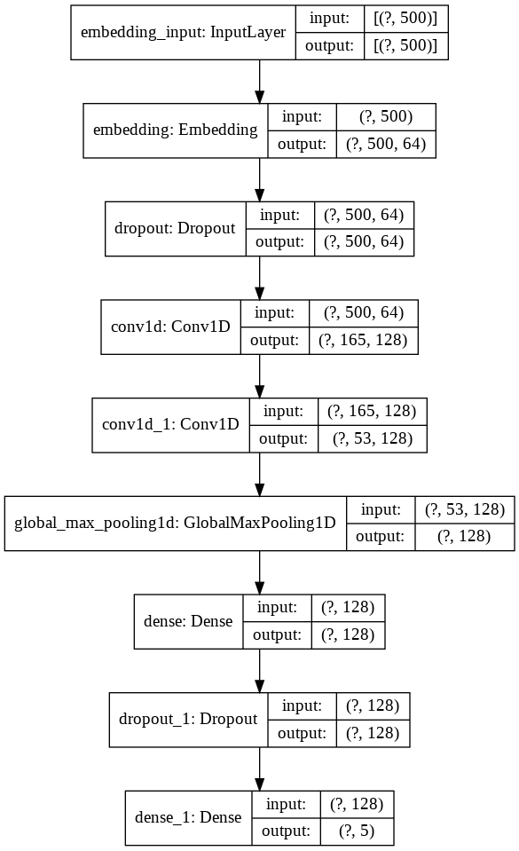

# AI 소설 작가 예측 대회

## 대회 요강 및 성적
- 각 작가의 소설 데이터(TEXT)를 기반으로 어떤 작가인지 예측하는 Multilabel classification
- 성적: 48/287 (상위 16%)

## 분석 방법론
    
- step1
    - remove stopwords  
    - Text Tokenizing
    - TextToSequence
    - padding(max:500)
    - simpleDNN
        -  
    - 5fold cross-validation
    - LB: 0.43
    
- step2
    - line by line labeling Text data write
    - FastText supervised train
        - used FastText API
    - 5fold cross-validation
    - LB: 0.306
    
    
    
## 아쉬웠던점 및 배울점
- 상위권 코드
    - [코드](https://dacon.io/competitions/official/235670/codeshare/1894?page=1&dtype=recent&ptype=pub)
    - XGB로 상위코드
- 배울점
    - 텍스트 관련 대회는 당연히 모델들이 중요하겠지만 전처리와 변수생성 하는 부분이 상당히 중요한 것을 알게됨
    - TFIDF, CountVec, SVD 등 다양한 변수 생성의 중요성
    - 아직 텍스트 관련 DL을 잘 다루지 못하는 것을 깨닫고, RNN, DNN, LSTM 등 기초 모델링에 대한 학습을 지속할 예정
    
    
    
    
    
